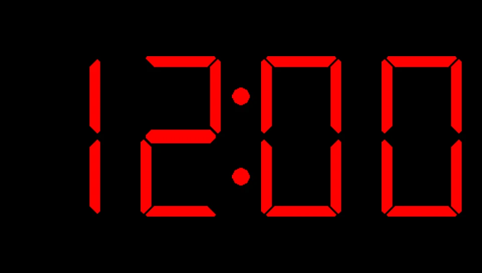
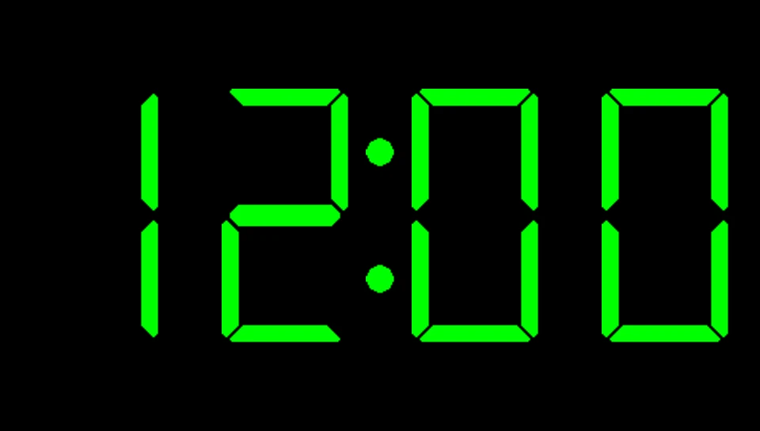
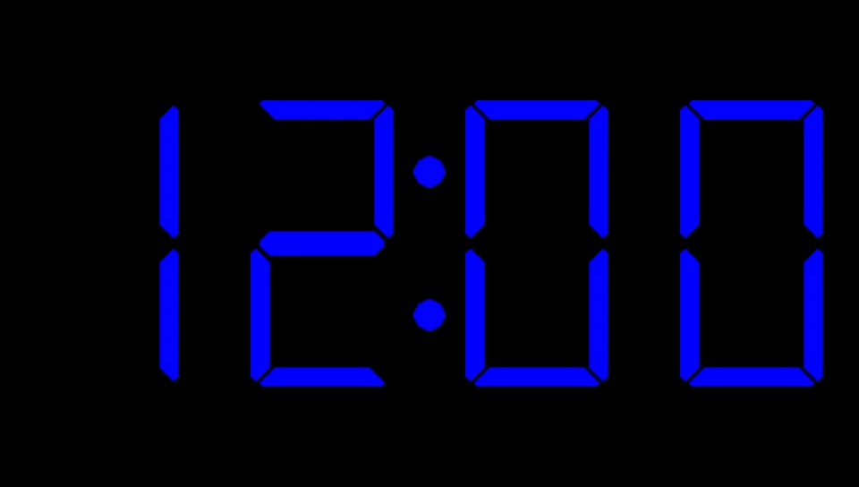

    <h1>Digital Clock PSP</h1>

    
    
    

---

A simple digital clock for your **PlayStation Portable**.
Made with [gLib2D by Geecko](https://github.com/libcg/gLib2D/).

---

## Installation

Download the latest release from [releases](https://github.com/danssmnt/Digital-Clock-PSP/releases). Unpack the ``.zip`` file and follow the installation instructions on the ``README.md`` inside it.

---

## How to use

 - Press  or  to change the clock color.
 - Press  to change between different brightness modes.
 - Press  to exit the app.

---

## Error diagnosing
> [!NOTE]
> If you follow all the installation instructions correctly (which are very few), no errors should popup on the app.

|Error|Code|Description|More info.|
|:----|:--:|:----------|:--------|
|``ERROR_SETUP_CALLBACKS``|``0x80000000``|Something went wrong while configuring the Exit Callback.|Something is likely very wrong with your firmware?|
|``ERROR_TEXTURES_NOT_FOUND``|``0x80000001``|Textures are missing from 'assets/textures/' !  Make sure all PNGs are in the correct directory.|The most common, make sure the texture files (``0.png``, ``1.png``...) are in their correct directory (``assets/textures/``).
|``ERROR_ALLOCATING_TEXTURES``|``0x80000002``|Unable to allocate memory for textures.|Probably you're out of RAM, try enabling `High Memory Layout` in your CFW settings if that option is avaliable. Also, disabling all plugins should help too.|
|``ERROR_GETTING_TIME_RTC``|``0x80000003``|sceRtcGetCurrentClockLocalTime() failed to provide time.|Something is likely very wrong with your firmware? Either this or something is patching the function. Disabling all plugins might help?|
|``ERROR_UNKNOWN``|``0x7FFFFFFF``|Something unknown went very wrong.|This error shouldn't appear at all...|

---

## Running / Compiling

### Dependencies

You'll need PSPSDK to compile this homebrew. Just use the latest, it'll work.

### Compiling

 1. Clone the repository, either by using ``git clone https://github.com/danssmnt/Digital-Clock-PSP``, or by going to "Code" -> "Download ZIP" and extracting it on your PC.
 > [!IMPORTANT]
 > (Optional) Set the ``assets/xmb/CUST_PARAM.SFO`` file to Read-Only. (To prevent ``make clean`` from replacing it).
 2. Go inside the cloned repository and, inside a terminal, write ``make``, it should compile without any errors / warnings.
 3. Run the created ``EBOOT.PBP`` on [PPSSPP](https://ppsspp.org), or directly on your PSP.

### Replacing Textures

If you want / need, you can replace all textures inside ``assets/textures`` for your own ones.

Keep in mind:

 - Textures must preserve the original aspect ratios: ``1:2`` for ``0.png -> 9.png`` and ``9:80`` for ``colon.png`` (unless you also modify the code)
 - Textures must be PNGs (``USE_JPEG`` is disabled in glib2d for binary size reduction)
 - Textures must have a max. width / height of 512 (because of PSP hardware limitations).

---

## Future Checklist

 - [ ] Battery indicator
 - [ ] Show date
 - [ ] XMB icon animation (``ICON1.PMF``)
 - [ ] Play music
 - [ ] Timer and chronometer
 - [ ] Alarm
 - [ ] Save clock settings
 - [ ] Make a minimal fork of glib2d

---

## Changelog

### v2.0.1
 - Switched to newest PSPSDK (pspTime -> ScePspDateTime)
 - Improved binary size by cutting JPEG support.
 - Organized the code better
 - Fixed drawing the first 0 when not needed
 - Added more colors
 - File exists func improved

### v2.0
 - Remade the whole app from scratch.
 - Fixed issue [#1](https://github.com/danssmnt/Digital-Clock-PSP/issues/1) (Timezones fix).
 - Updated, optimized and improved textures for digital numbers.
 - Added colors.
 - Added brightness modes.
 - Added error messages for diagnosing problems.
 - Improved / Optimized code (a lot).

### v1.0
 - Created the app.
 - A simple digital clock with minimal features.

---

## Acknowledgements
 - [**@mizabmdgg**](https://github.com/mizabmdgg) - Found issue [#1](https://github.com/danssmnt/Digital-Clock-PSP/issues/1) and even made their own [fork](https://github.com/mizabmdgg/Digital-Clock-PSP/tree/main) to solve it.
